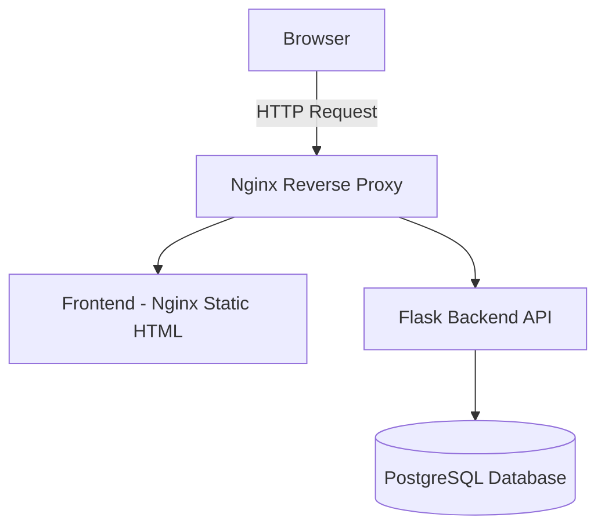

# 🚀 Multi-Service Docker App

This project is a **real-world style multi-service application** built with **Docker** and **Docker Compose**.  
It simulates a production-like environment using multiple containers, networks, and a reverse proxy.

---

## 📌 Features
- **Frontend**: Simple HTML page served through Nginx.  
- **Backend**: Flask API that connects to PostgreSQL.  
- **Database**: PostgreSQL stores a page visit counter.  
- **Reverse Proxy**: Nginx routes requests to frontend and backend services.  
- **Multi-Network Setup**: Isolates backend from external access, only exposed via Nginx.  
- **Persistent Storage**: Database uses Docker volumes for data persistence.  

---

## 🏗️ Architecture

⚡ Getting Started
1. Clone the repo
```bash
git clone https://github.com/nasser-tarek/multi-service-docker-app.git
cd multi-service-docker-app
```
2. Build and run with Docker Compose
```bash
docker-compose up --build
```
3. Access the app on http://localhost:8080
